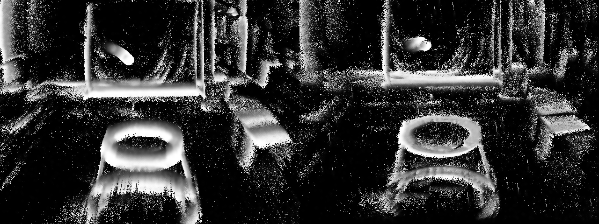
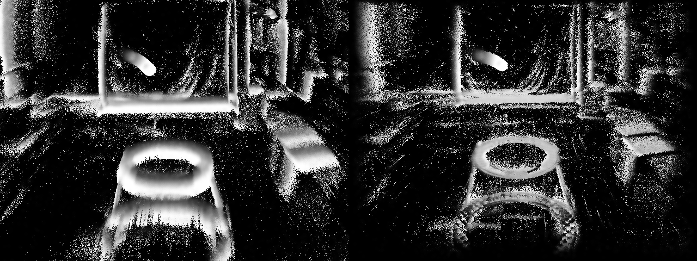
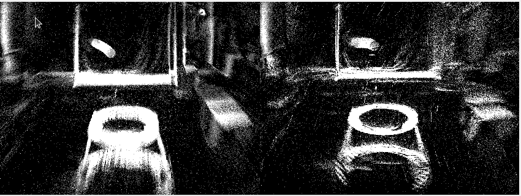
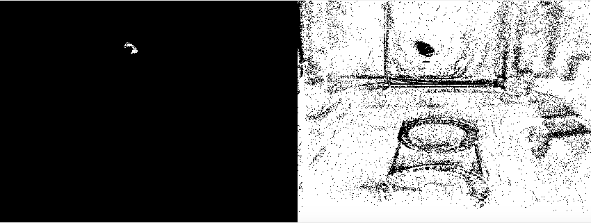

# Event-Based Robot Vision

A ROS-based computer vision project for **motion compensation and moving-object detection using event cameras**.

The project processes asynchronous event streams, estimates camera motion, compensates event motion, and detects moving objects.

## 1. Project Background

Event cameras record pixel-level brightness changes asynchronously instead of conventional image frames. When the camera moves, background events become spatially misaligned.

This project investigates motion compensation for event-based robot vision using:

- 2-DoF, 4-DoF and 6-DoF motion models
- Time Surface and Event Count representations
- Contrast-based optimization
- Optional depth information
- Moving-object detection after motion compensation

### Pipeline

```text
Event Stream
     ↓
Motion Estimation
     ↓
Event Warping
     ↓
Motion-Compensated Representation
     ↓
Moving Object Detection
```

---

## 2. Docker Setup

The project uses Docker to provide a reproducible ROS Noetic development environment.

### Base Image

The current configuration uses the **ARM64 ROS Noetic image** to match the target `aarch64` platform, therefore, the Docker image is based on:

```dockerfile
FROM arm64v8/ros:noetic
```

If you are running the project on the x86 platform, change the Dockerfile image source to:

```dockerfile
FROM osrf/ros:noetic-desktop-full
```

The Docker image contains:

- ROS Noetic
- OpenCV, Eigen3, GSL and Ceres
- `autodiff`
- `cnpy`
- `catkin_simple`
- `minkindr`
- `rpg_dvs_ros`
- Required ROS packages and build dependencies

The project source code and ROS bags are mounted from the host machine at runtime.

### Build the Docker image

From the repository root:

```bash
docker build -t fast_dynamic:noetic .
```

The image only needs to be rebuilt when the Docker environment or dependencies change.

**You do not need to rebuild the image after modifying the project source code or launch files.**

---

## 3. Download the ROS Bags

Create a `bags` directory in the repository:

```bash
mkdir -p bags
```

### Slider sequences

The project uses event-camera sequences from the UZH RPG DAVIS dataset.

For example:

```bash
cd bags

wget http://rpg.ifi.uzh.ch/datasets/davis/slider_depth.bag
wget http://rpg.ifi.uzh.ch/datasets/davis/slider_far.bag

cd ..
```

The dataset contains several event-camera sequences. Other sequences used by the project include:

| `bag_ind` | Sequence |
|---:|---|
| 0 | `slider_depth` |
| 1 | `slider_far` |
| 2 | `what_is_background` |
| 3 | `test_vins` |
| 4 | `simulation_3planes` |

Check a bag before running:

```bash
rosbag info bags/slider_depth.bag
```

The event stream should contain:

```text
/dvs/events
```

with message type:

```text
dvs_msgs/EventArray
```

---

## 4. Run the Docker Container

Because the project uses `rqt_gui` and OpenCV visualization windows, X11 forwarding is required on Linux.

First allow the Docker container to access the display:

```bash
xhost +local:docker
```

Then start the container from the repository root:

```bash
docker run --rm -it \
  --network host \
  -e DISPLAY=$DISPLAY \
  -e QT_X11_NO_MITSHM=1 \
  -v /tmp/.X11-unix:/tmp/.X11-unix:rw \
  -v "$(pwd):/catkin_ws/src/fast_dynamic" \
  -v "$(pwd)/bags:/catkin_ws/bags" \
  fast_dynamic:noetic
```

The volume mounts provide:

```text
Host                              Container
────────────────────────────────────────────────────
./                                /catkin_ws/src/fast_dynamic
./bags                            /catkin_ws/bags
```

This means that changes made to the source code or launch files on the host are immediately visible inside the container.

---

## 5. Build the ROS Workspace

The project source code is mounted into the container, so the workspace needs to be built after starting the container.

Inside the container:

```bash
cd /catkin_ws

catkin_make -DCMAKE_BUILD_TYPE=Release \
  -DCATKIN_BLACKLIST_PACKAGES="davis_ros_driver;dvs_ros_driver;dvxplorer_ros_driver;dvs_calibration;dvs_calibration_gui;dvs_file_writer"
```

Then source the workspace:

```bash
source devel/setup.bash
```

### Why are some packages blacklisted?

`rpg_dvs_ros` contains several hardware driver packages that require additional hardware-specific dependencies such as `libcaer`.

This project replays recorded ROS bags instead of connecting directly to a DAVIS/DVS camera, so these hardware drivers are not required.

The required packages, including `dvs_msgs` and `dvs_renderer`, are still built.

---

## 6. Configure the Launch File

The main launch file is:

```text
launch/motion_compensate.launch
```

Before the first run, configure the following items.

### 6.1 Bag path

The bag is mounted inside the container at:

```text
/catkin_ws/bags/
```

For example:

```xml
<arg name="bag_args"
     default="/catkin_ws/bags/slider_depth.bag"/>
```

The `rosbag play` node should also use the corresponding path:

```xml
<node pkg="rosbag"
      type="play"
      name="player"
      args="-r 0.1 -d 1.0 -s 0. /catkin_ws/bags/slider_depth.bag"
      output="screen"/>
```

Adjust the filename according to the dataset you want to use.

### 6.2 Dataset index

Set:

```xml
<param name="bag_ind" value="0"/>
```

according to the sequence:

| `bag_ind` | Sequence |
|---:|---|
| 0 | `slider_depth` |
| 1 | `slider_far` |
| 2 | `what_is_background` |
| 3 | `test_vins` |
| 4 | `simulation_3planes` |

The value selects the corresponding camera intrinsics in `get_intrinsic_params()`.

---

## 7. Run the Project

After building and sourcing the workspace:

```bash
roslaunch fast_dynamic motion_compensate.launch
```

The launch file starts:

- ROS core
- `rosbag play`
- `fast_dynamic`
- event rendering
- `rqt_gui`

The typical processing flow is:

```text
ROS Bag
   ↓
/dvs/events
   ↓
Event Processing
   ↓
Motion Estimation
   ↓
Event Warping
   ↓
Motion-Compensated Event Representation
   ↓
Moving Object Detection
```

---

## 8. Manual Run

For debugging, the components can also be started separately.

### Terminal 1

```bash
roscore
```

### Terminal 2

```bash
source /catkin_ws/devel/setup.bash

rosrun fast_dynamic fast_dynamic \
  events:=/dvs/events \
  _bag_ind:=0
```

The `events:=/dvs/events` remap is important because the node subscribes to the relative topic name `events`.

### Terminal 3

```bash
rosbag play /catkin_ws/bags/slider_depth.bag
```

This is useful for debugging topic connections independently of the launch file.

---

## 9. Topics

### Input

Event stream:

```text
/dvs/events
```

Message type:

```text
dvs_msgs/EventArray
```

### Optional depth input

When `enable_depth` is enabled:

```text
/camera/depth/image_rect_raw
```

is used for `bag_ind = 3` (`test_vins`), while:

```text
/dvs/depthmap
```

is used for the other supported sequences.

Depth mode also requires `bag_args` to point to the same bag being played.

### Output

The project publishes several image topics through `image_transport`:

```text
event_count
avg_time_map
mc_event_count
mc_time_map
mask
depth_map
```

These can be visualized using `rqt_image_view` or the provided RQT perspective.

---

## 10. Launch Parameters

| Parameter | Meaning |
|---|---|
| `num_events_map_update` | Event batch size per map update |
| `optimize_image_type` | `0`: TimeMap, `1`: EventCount |
| `contrast_ind` | `0`: norm, `1`: variance, `2`: gradient magnitude |
| `lr_x`, `lr_y`, `lr_div`, `lr_rot` | Learning rates for translation, divergence/scale and rotation |
| `tm_max_iter` | Maximum optimization iterations |
| `filter_threshold` | Threshold for the moving-object mask |
| `filter_small_compo` | Keep only the largest valid foreground component |
| `better_initial`, `random_initial` | Initialization options |
| `enable_depth` | Enable depth information |
| `depth_x_bin_num`, `depth_y_bin_num` | Depth patch grid size |
| `enable_undistort` | Undistort events using camera calibration |
| `plot_hist` | Display a histogram window |
| `bag_ind` | Select camera intrinsics for the dataset |
| `bag_args` | Bag path and options used in depth mode |

> **Note:** The motion model is not selected through a launch parameter. The 4-DoF/6-DoF processing path is selected in `checkAndProcess()` in `motion_compensate.cpp` through `processMessages()` or `processMessages_v2()`. Rebuild the workspace after changing this code.

---

## 11. Development Workflow

The Docker setup is designed for iterative development.

### Modify a launch file

Modify the file on the host:

```text
launch/motion_compensate.launch
```

Then restart:

```bash
roslaunch fast_dynamic motion_compensate.launch
```

No Docker rebuild is required.

### Modify C++ source code

After changing files under:

```text
src/
include/
```

rebuild inside the container:

```bash
cd /catkin_ws

catkin_make -DCMAKE_BUILD_TYPE=Release \
  -DCATKIN_BLACKLIST_PACKAGES="davis_ros_driver;dvs_ros_driver;dvxplorer_ros_driver;dvs_calibration;dvs_calibration_gui;dvs_file_writer"

source devel/setup.bash
```

Then run:

```bash
roslaunch fast_dynamic motion_compensate.launch
```

### When is `docker build` required?

Only rebuild the Docker image when changing the environment, for example:

- Dockerfile
- system packages
- ROS dependencies
- `autodiff`
- `cnpy`
- third-party ROS dependencies

Normal source-code and launch-file changes do not require rebuilding the image.

---

## 12. Results & Visualization

Example 2-DoF results:



Example 4-DoF results:



Example 6-DoF results:



Moving-object detection example:




The results demonstrate how motion compensation can align background events and provide a better representation for subsequent moving-object detection.

---

## Attribution

The **moving-object detection component** of this project was developed by **Jiaming Li**.

---

## 13. Citation

Parts of this project are adapted from the following works:

- **Moving-object detection:** adapted from Mitrokhin et al. [1].
- **Contrast maximization and motion compensation:** adapted from Gallego et al. [2].
- **Event-camera dataset:** based on the dataset introduced by Mueggler et al. [3].

If you use this project or its related methods, please also cite:

```bibtex
@inproceedings{mitrokhin2018event,
  title={Event-based moving object detection and tracking},
  author={Mitrokhin, Anton and Fermuller, Cornelia and Parameshwara, Chaithanya and Aloimonos, Yiannis},
  booktitle={IEEE/RSJ International Conference on Intelligent Robots and Systems (IROS)},
  year={2018}
}

@inproceedings{Gallego_2018,
   title={A Unifying Contrast Maximization Framework for Event Cameras, with Applications to Motion, Depth, and Optical Flow Estimation},
   url={http://dx.doi.org/10.1109/CVPR.2018.00407},
   DOI={10.1109/cvpr.2018.00407},
   booktitle={2018 IEEE/CVF Conference on Computer Vision and Pattern Recognition},
   publisher={IEEE},
   author={Gallego, Guillermo and Rebecq, Henri and Scaramuzza, Davide},
   year={2018},
   month=June, pages={3867–3876} }

@article{mueggler2017event,
  title={The event-camera dataset and simulator: Event-based data for pose estimation, visual odometry, and SLAM},
  author={Mueggler, Elias and Rebecq, Henri and Gallego, Guillermo and Delbruck, Tobi and Scaramuzza, Davide},
  journal={The International Journal of Robotics Research},
  volume={36},
  number={2},
  pages={142--149},
  year={2017}
}
```